# Train is home — the Option B cycle (September 2026)

Owner decision, 25 September 2026: Option B of the 24 September review ("Spotter, simplified",
https://claude.ai/artifact/JipkBFW48WBnQ6tMDeK5Wz). Train becomes the first tab and answers "what now?" with one card;
Workouts becomes the library; a paused session follows you across tabs; the month is a pull-down of the week strip.
No feature was removed — every one has a home, listed in the relocation table below.

Branch `simplify-b`, iOS build 10. Six build branches (seams, sb-train, sb-library, sb-card, sb-workout, sb-ready)
merged into it; a read-only spike (sb-spike); an independent QA pass and an independent diff review afterwards.

## The core loop, before and after (tap counts)
Measured on the iPhone 16e simulator with the fixture account (8 cards, 3 never done, a two-week plan with a missed
day, a paused session) unless marked "from the code path".

| Task | Before (main, build 9) | After (build 10) | What changed |
|---|---|---|---|
| Share a video, then log the first set (iOS) | 9 — Share · More · Spotter · Done · open the app · card · Start workout · Set 1 · Save set (code path) | QA | The ready notification's Start Now (or the ready sheet on the next open) goes straight to Workout Mode; the big button logs set 1 |
| Open the app and start today's workout | 1 on Library (it opened there) · 2 on Train (tab + Start) (measured) | QA | The app opens on Train; Up next's Start workout |
| Log one set | 2 — the set pill, then Save set (measured) | QA | "Log set 1 · 8 × 90 lb" is one tap; the set sheet is still one tap away on the pill |
| Plan a saved workout for Thursday | 6 — card · Schedule · › month · the day · ✓ · Add to plan (5 inside the month) (measured) | QA | The card's pinned Plan opens the fortnight sheet: tap Thursday, "Plan 1 day" |
| Finish, then see the week | 3 — Save workout · ✕ · Train (code path) | QA | Finish on the last set; the recap closes onto Train, where the week is |

## What changed, screen by screen

### Train (first tab, opens by default)
- **Header**: today's date as the eyebrow ("Fri, Sep 25"), the streak and the week ring in the header's corner (the
  ring opens What counts, which now says how the week stands and which freezes were spent), a compact + (Add video),
  the gear.
- **Week strip → month**: one grid seen through a one-row window. Pull down on the strip, or tap its handle or its
  name, and the month opens in place with the selected week's row anchored. Axis chosen at 10 px; the touch is claimed
  on its first move (WebKit) or at the axis lock (Chrome); 1:1 tracking with half speed past the month; release at
  150 px/s or the nearer end; the tab pager's critically damped spring; a crossfade under reduced motion. Sideways
  still pages the week, or the month while it is open. The legend, the month name with ‹ › and Today, and a ⋯ (Copy
  week, Build with Pumpy, What counts) appear only while open. It always opens collapsed; the `plan` link opens it.
  VoiceOver: each day is a sentence, the handle says whether the month is open, week buttons exist for VoiceOver.
- **One day card.** Today is Up next (`upNext()`): S0 a skeleton at the planned card's height, S1 Paused / In progress
  (Resume, Finish workout), S2 Planned today (Start workout; Move · Swap · Remove from plan under ⋯; "+N more today"),
  S3 Done today (View recap, what is next, Log another), S4 Rest day (Start it now, Plan a workout today), S5 Try next
  / Do it again, S6 the first-video lesson with Add video. Any other day (`dayState()`): past → its sessions and
  missed rows (Do it today, Remove); future → its planned rows (Start now, Move, Remove); nothing → + Plan a workout;
  a Back to today chip. Remove is a delayed delete with Undo.
- **Ready to try shelf**: up to ten saves never part of a finished session, newest first; See all opens Workouts
  filtered.
- **Progress · Records** segments (Calendar is now the pull-down; a stored "calendar" reads as Progress). Records
  label the PR figure "est. max".
- **One Build with Pumpy**: the month's ⋯ and the rest-day card's link.
- Deleted: the hero row, the Today card, the Calendar segment, the day sheet, #copypumpy, isoWeek, loggedOn.

### Workouts (second tab)
- Header "Workouts", "N saved", "+ Add video". Search, filters, collections, sort, favorites, pull to refresh, the Plus
  meter, processing / failed / empty states all stay.
- Chips: Filters · Ready to try (N) · Collections · Sort. Ready to try reads the shelf's own list; a "Ready to try ·
  N workouts ×" line says the narrow is on.
- One status per card, as a solid pill on the picture's corner, without growing the card: New · Planned Thu · Done
  3× · Sep 20. The duration badge moved to the top-left to make room at 375 px. Statuses repaint only the cards a
  plan or log change touched; the words are memoised per status and day.
- Deleted: the Resume card, the Today card, the web-only install hint.

### The paused bar (every tab)
A paused session is one bar above the tab bar: pause mark, title, "Paused · N sets · 12 min", Resume, and Finish as
the leave sheet's flag, which takes two taps ("Tap again to save N sets", announced to VoiceOver; it lapses after
4 s; the second tap counts only once the question has been on screen 300 ms). Tapping the body resumes. It rises from
behind the tab bar, fades under reduced motion, never shows over Workout Mode, hides with the keyboard, and its
measured height joins the pages' bottom inset, Pumpy's composer and the toast.

### The card
- A 16:9 cover (the thumbnail or Pumpy's drawing); a tap plays the original with its caption ("Watch original").
- Facts as text ("~45 min · 6 exercises · 12 sets", one gear line); the read caveat folded to one line.
- Compact rows: name, a two-line cue, a ▶ with the second the video shows it, the rest as text. A tap opens the
  exercise sheet; swipe to remove with Undo stays. "Added by you" / "Edited by you" moved into the row's meta line.
- ⋯ Workout sheet: Ask Pumpy, Rename, Collections, Share, Reorder, Read it again, Remove (with Undo).
- Below the list: Improve this read (the Basic/Plus offer that sat above Start, Paste the caption, Read it again),
  section edit, add exercise and section, muscles worked, notes and category, the caption.
- A pinned dock: Start workout (Resume when paused) and Plan. Nothing stands between a new user and Start.

### The exercise sheet — `openExerciseSheet(ctx)`
One inset-grouped sheet, from a card row or from Workout Mode's ⋯: the whole cue and the creator's difference, Watch
this part, Demo, Edit exercise (which holds the rest wheel), Swap, Reorder, Add set, Add an exercise, Remove (alone,
in red, with Undo).

### Workout Mode
- The big button logs the next set through `logNextSet()` — the door the Lock Screen and the Watch use, so all three
  agree on the set number and the figures: "Log set 2 · 8 × 90 lb" (bodyweight "12 reps", dumbbells "each"), "Start
  0:45" then Pause/Resume for a hold, "Round 3 done" on a complex, "Log a set" in freestyle, and "Finish workout" once
  the last planned set is in. The set sheet stays one tap away on the set pills.
- "Set 2 logged · Undo" for five seconds (Undo takes back the set, its rest, the screen it moved on from and any best).
- Finish is a pill at the top right: at once when every planned set is in, otherwise the leave sheet asks ("2 sets
  not logged": Finish workout, Pause workout, Keep going). Nothing is discarded.
- "Exercise 2 of 5", then the name, then one goal line ("Goal 2 × 6-8 · last time 8 × 90 lb"); neutral progress, no
  red "0 / 2 sets completed".
- ⋯ Exercise opens the shared exercise sheet (Watch, Demo, Swap, Add set, Add an exercise).
- LiveState v1 is unchanged byte for byte; a LiveAction may carry an eventId so a replayed set is harmless.

### Plan sheet and picker
- `openPlanSheet`: the next fourteen days on the week strip's own cell and dot, several at once, "Plan N days". Move
  is the same sheet with one day. The old date sheet and `scheduleWorkout` are gone.
- `openPicker`: search first, then Ready to try, Recent, All (A–Z); Swap replaces a planned row.
- `planWrite`: every plan write is on screen at once, really written, and behind one Undo that removes exactly those
  rows (ids come back from the insert).

### The ready moment
- A save becoming a workout arrives as a sheet: cover, "Ready to train", title and one line, Start now, "Or plan it"
  (Today, Tomorrow, the next five days; More opens the Plan sheet), Look it over first, Not now.
- Four doors, one set of manners (Apple's "discoverable but not distracting"): a card turning ready with the app up,
  a save that came back ready at once, the app opening on one that turned ready while away, and the notification.
  Never over Workout Mode, never over another sheet or a keyboard (it waits up to two minutes), once per card
  (localStorage per account, bounded at forty), not for the card already open, one greeting per open.
- The `card_ready` push (server): a save made outside the app (Share Extension, Shortcut, Android's share) is
  announced when its card is ready, with Start Now and Plan It (category CARD_READY); a burst collapses into one
  banner ("spotter-ready"), coalesced over two minutes. Settings → Reminders → "When a saved video is ready" (absent
  = on; written only to say Off).
- With the app in front, the notification is not a banner: the page shows the sheet by its own quieter rules.
- The spike: no supported, review-safe way for a Share or Action extension to open the app (Apple allows `open` only
  from Today and iMessage extensions; the responder-chain workaround broke on iOS 18), so the push carries the way back.

### The recap
"Plan your next one" under the figures — the same workout on the six days after today, one tap each with Undo, and
Pick another. The first time a Basic-read TikTok card is done, the read offer appears here (it no longer sits above
Start).

### Wording (applied everywhere, scanned by tools/simplify-b-harness.mjs)
Add video · Finish workout · Plan / Move / Remove from plan · Section · Workouts · Watch original / Watch this part /
Demo · Edit exercise · Remove (with Undo; irreversible deletes keep Delete + confirm) · ⋯ with sheets "Workout",
"Exercise", "Session" · the week as a date range ("Sep 21–27"), a streak as "3-week streak" · Favorites. The share
extension says "Save to Spotter" and its receipts say Workouts.

## Research
- The month pull-down: 11 apps and libraries (iOS Calendar, Fantastical, Structured, Runna, Google Calendar, Todoist,
  FSCalendar, react-native-calendars, table_calendar, Kizitonwose) plus Apple's and Android's gesture numbers. First-party
  apps publish no thresholds; FSCalendar and react-native-calendars do. Taken: a 10 px axis lock, 1:1 tracking, commit
  at 150 px/s or half-way, the selected week's row anchored while the others unfold, the tab pager's critically damped
  spring after a drag, only when the page is at its top; VoiceOver gets a button and actions. Found while building:
  the engines differ on when they commit to scrolling (Chrome holds touchmoves back past its slop), so the touch is
  claimed at the first touchmove or at the 10 px lock, whichever comes first.
- One-tap logging and Finish: Hevy, Strong, Alpha Progression, StrongLifts, Gravl, Boostcamp; Apple HIG. Taken: the
  big button logs the next set with prefilled numbers (Hevy's checkmark, StrongLifts' circle), rest starts at once,
  one haptic, a PR toast that does not block; a short Undo (our own call: a full-width button makes mistaps likelier);
  Finish as a quiet pill top right (Hevy, Strong), confirming only when sets are left; neutral progress.
- The status on a card: Pinterest, ReciMe, Paprika, Mela, Netflix, Spotify, Apple Books, Peloton; NN/g on indicators and
  cards; Material's date wording. Taken: one status, on the thumbnail, solid pills with an icon so colour is never the
  only signal, "today / tomorrow / Thu" for the coming week.
- The paused bar: iOS 26's tab bar bottom accessory (Music, Podcasts: one persistent bar on every tab, a tap opens the
  full view); Hevy's minimised workout (Resume plus an end control); an inline two-tap confirm for the end action.
- Today vs selected day and the way back: iOS Calendar (colour for today, a filled cell for the selection), Google
  Calendar, Structured and Todoist (tap the title for the month; a way back to today).
- The ready moment: Apple HIG, Notifications ("discoverable but not distracting" for news in the foreground; title-case
  actions; a hidden-previews placeholder).

## Relocation table
| Feature | Before (build 9) | After (build 10) | Verified |
|---|---|---|---|
| Resume / End a paused session | Library Resume card; the card's button | The paused bar on every tab (Resume, two-tap Finish); Up next S1; the card's Resume | QA |
| Today's planned workout | Library Today card; Train Today card | Up next on Train (S2) | QA |
| Day details, sessions on a day, add to a day | The day sheet (no Start, no Move) | The selected-day card under the strip (Start now, Move, Remove, Do it today, + Plan a workout) | QA |
| Month grid, legend, Copy week, Build with Pumpy, What counts | Calendar segment (Pumpy ×2 there, ×3 elsewhere) | Pull the strip down; its ⋯ (Pumpy once there, once on the rest day); the ring → What counts | QA |
| Progress, Records, awards | Train segments | Progress · Records segments ("est. max") | QA |
| Search, filters, collections, sort, favorites, pull to refresh, Plus meter | Library | Workouts | QA |
| Watch this part, demo, edit, rest, swap, reorder, remove exercise | Three controls per row, an Options fold, the rest sheet | The exercise sheet (+ swipe to remove); rest in Edit exercise | QA |
| Rename, collections, share, read again, remove, Ask Pumpy | Options sheet + a chip | The ⋯ Workout sheet | QA |
| Watch original and caption | A folded row | The cover; the caption under the list | QA |
| Plus and Basic read offers | Above Start | "Improve this read", the recap, the save limit | QA |
| Set logging | Pill + sheet (2 taps) | The big button (1 tap); the sheet one tap away | QA |
| Swap, demo, clip, add exercise mid-workout | Options fold, bottom Add exercise | ⋯ Exercise | QA |
| Finish | The big button at the bottom | A pill at the top right; the big button after the last set | QA |
| Section edit, add exercise and section, muscles, notes and category | Scattered | Below the list | QA |

## Page size
The page ships inside the app, so this is parse and memory, not download. Measured on `web-dist/index.html` (comments
stripped, whitespace kept) at each merge point:

| Point | Bytes | gzip -9 | Change |
|---|---|---|---|
| main (build 9) | 829,567 | 216,689 | |
| Seams: tab order, Train cache, one plan read, the pure rules (Up next, day, ready list, statuses, fortnight, ready pick), `logNextSet`, sheet shells, wording | 842,139 | 219,652 | +12,572 |
| Workout Mode (sb-workout) | 844,225 | 220,219 | +2,086 |
| The card, exercise sheet, Plan sheet, picker (sb-card; paid back 1.8 KB of dead rules) | 847,296 | 221,453 | +3,071 |
| The ready moment: sheet, four doors, recap next step, switch, `spotter://ready` (sb-ready) | 857,553 | 224,060 | +10,257 |
| Integration (one plan write for the chips, watch title, status memo) | 857,568 | 224,155 | +15 |
| Train: pull-down engine and two-way gesture ~5.1 KB, day card states ~6.4 KB, month grid 2.2, shelf 1.2, header 1.0, Remove/Do it today 1.1; 8.9 KB deleted (sb-train) | 867,641 | 227,986 | +10,073 |
| Workouts and the paused bar (sb-library; paid back the Resume card, Today CSS, install hint) | 868,612 | 228,071 | +971 |
| Integration (dead CSS) | 868,369 | 228,044 | −243 |
| Review fixes, senior: `draftCheck`, `cardOff`, the recap guard, the paused bar's Finish, image menu, wording | 870,077 | 228,539 | +1,708 |
| Review fixes, agent: `nextSet`, the "is paused" sheet, plan rows, `showCard`, Move on missed rows | 871,220 | 228,842 | +1,143 |
| QA fixes: refresh keeps the logs, one clock | 871,288 | 228,879 | +68 |
| QA fixes: the held toast and its tap shield, Train's ⋯ rows, month title, See all, toast width, past days | 872,599 | 229,298 | +1,311 |
| **Total** | **872,599** | **229,298** | **+43,032 (+5.2 %); gzip +12,609 (+5.8 %)** |

Over the +12 KB target. What is left is the behaviour the spec asks for (the pull-down, seven Up next states, the
ready moment's four doors, the fortnight sheet); each agent deleted what its area retired, and the candidates left to
cut are 0.1–0.4 KB each (catching the month mid-motion, scroll-to-top before opening, thumbnails on other days' rows).
Whitespace is most of the page and a minifier would take far more than this cycle added; that is a build change for
its own cycle, not this one.

## Server
Additive only, no migration (`ingest_jobs.meta` and `profiles.settings` are JSON):
- `/api/ingest` marks a save made with the ingest key (Share Extension, Shortcut) or `source: "share"` with
  `meta.notify_ready`; `finishJob` sends `card_ready` in the background. A notification that cannot be sent never
  fails the save.
- `push.ts`: `postApns` shared by the reminders (their bytes and headers unchanged) and `sendApnsReady`.
- Old builds (5–9) receiving `card_ready` show a plain banner with no buttons (their app registers no CARD_READY
  category); a tap opens the app.
- Wording in server messages: "Already in Workouts.", "Use Read it again in the ⋯ menu to retry.", Pumpy's "Looking
  through your workouts…".

## The independent review, and what it changed
A fresh agent reviewed `main...simplify-b` at 16d0f0f (`briefs/simplify-b/REVIEW.md`, not published): 10 bugs, 7 spec
gaps, verdict "not TestFlight yet". Fixed on `sb-fix` (senior) and `sb-fix2` (one agent), then merged:
- **A paused session is never lost to a stale list.** The paused bar used to clear the draft whenever its card was
  missing from the list on screen (a boot on an old cache, a Remove still offering Undo). Now the bar only hides; the
  server is asked (`draftCheck`), and the session goes only on its word or with its card once a Remove has landed
  (`dropDraftOf`, which also ends the Lock Screen card).
- **⋯ → Ask Pumpy and ⋯ → Remove close the card on iOS.** Two `history.back()` calls in one task are one traversal in
  WebKit; both rows now leave in one navigation (`cardOff`). Checked in macOS WebKit before and after.
- **An offline recap refuses the stripped copy.** View recap opens only the full session row; offline it says so,
  so a correction can no longer write lite entries over the real session.
- **One next set.** `nextSet()` is read by the button's label, `logNextSet` and `liveState`, so the phone, the Lock
  Screen and the Watch name and log the same set at the same dose (a superset's dialled weight, a set logged out of
  order); the Lock Screen follows the steppers a beat later. LiveState v1 keeps its shape.
- **Start never throws a paused session away.** Starting another card while one waits with sets in it asks first:
  "<title> is paused · N sets logged" → Finish <title> / Resume <title> / Cancel. No Discard. With nothing logged it
  says so ("Closed <title> — nothing was logged.").
- **Plan rows.** Do it today goes through `planWrite` (insert first, one Undo, no double plan today); a row still
  waiting for its id says "Saving…" with its Move/Remove disabled; a missed row can be moved; a card opened over
  another card takes its place in history (Look it over first, `spotter://workout|start`, citation chips).
- **Finish from the paused bar** is the session's own Finish when sets are left (the leave sheet asks, as Up next's
  and the pill's do); with every planned set in it keeps its two taps.
- **Smaller:** the new covers, shelf and ready sheet get no iOS image menu; leftover "library" wording; the wording
  scan reads any case; the recap's chips cover seven days; the ready push's cache-hit over-count is documented.
- **Kept, with the reason written down:** the month pull-down claims a level-or-down first move rather than the
  research note's 2 px, because a finger starts from rest and a deliberate pull's first move is often under a pixel.
- **Left as follow-ups:** Pumpy's SQL message "Your library is full." (needs a migration); an in-context ask for
  notification permission so new users actually get `card_ready` (today it reaches people who turned on a reminder
  or the new switch); five near-duplicate helpers the review listed; the card dock's fixed bottom padding.

## Checks
TODO (final): `npm run verify:local`, `npm run parity:check`, `npm run gtm:check` (54 groups, incl. the 36-check
simplify-b harness and the 119-check pager harness), `tools/apns-harness.ts` 64/64, the QA pass, the review.

## Not verified on a device
TODO (final).

## Decisions made in the cycle (small, reversible)
- Up next counts a planned row as done when a session today trained that workout; a different workout trained
  instead leaves the plan standing (S2, with today's session noted).
- S4 with nothing ahead still offers a pick to "Start it now".
- The `plan` link opens Train with the month out; `spotter://tab/train` is accepted.
- Paused bar: Finish is the leave sheet's flag and takes two taps (the owner's wording "Finish workout"; no Discard).
- Up next S1's second button says "Finish workout" and takes the session's own Finish path (asks when sets are left).
- Workouts: the duration badge moved to the top-left; the chip row still wraps at 375–390 px (Sort drops to a second
  line); "Sort" alone in the default order.
- "Once per card" for the ready sheet lives in localStorage per account, not `profiles.settings` (written whole; a
  per-sheet write would race every other setting).
- The ready switch is on when absent and written only to say Off.
- Both the paused bar and Up next S1 show a paused session on Train, as the spec asks.

## Evidence
After, at 375 × 812 in the offline lab (fixture rows around today), light and dark — `design/simplify-b/`:

| Screen | Light | Dark |
|---|---|---|
| Train: Up next (planned today), the strip, Ready to try | 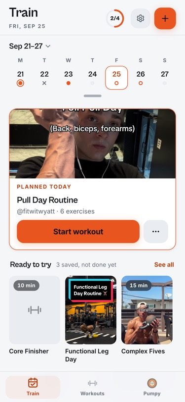 | 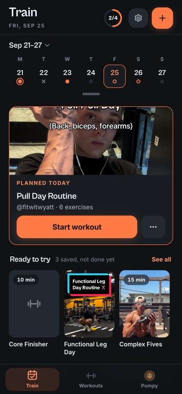 |
| The strip pulled down into the month, with its ⋯ | 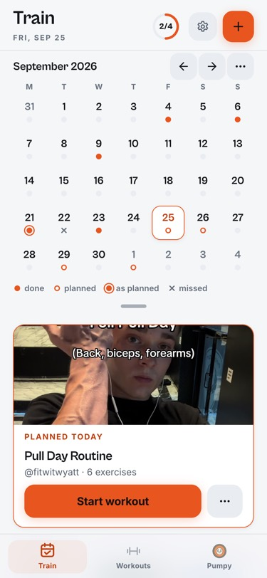 | 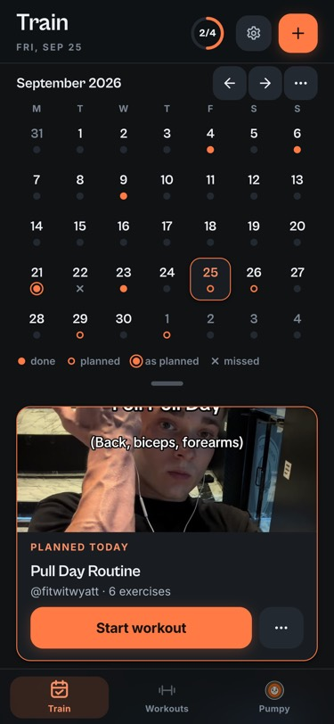 |
| A paused session: Up next S1 and the paused bar | 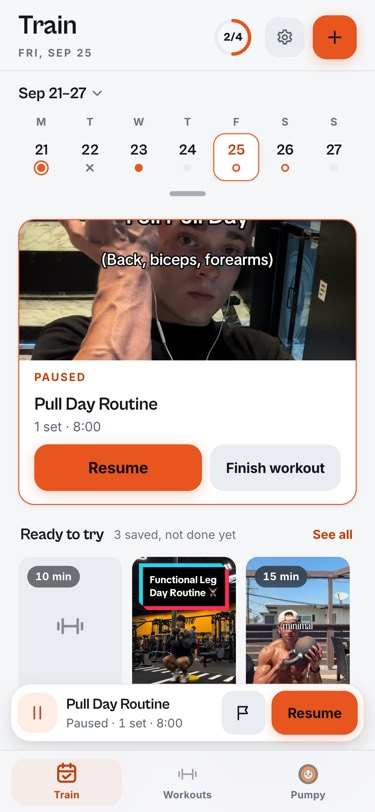 | 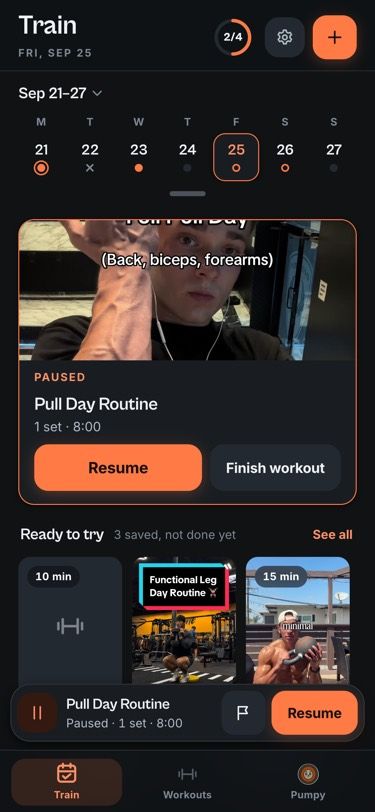 |
| Workouts: chips, one status per card | 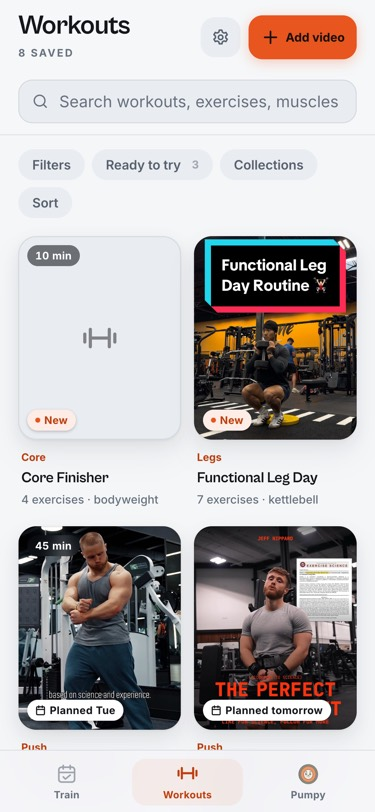 | 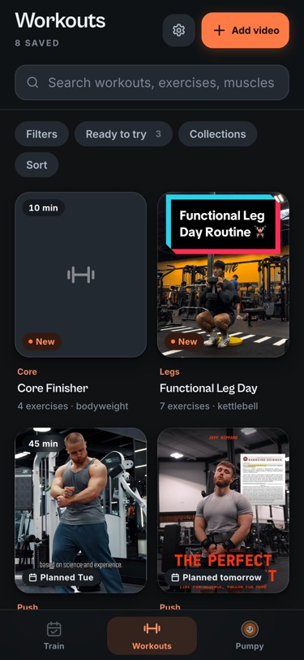 |
| The card: cover, facts, compact rows, the Start / Plan dock | 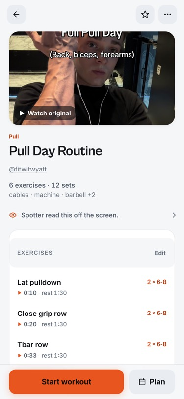 | 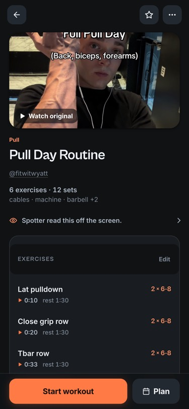 |
| The exercise sheet from a row | 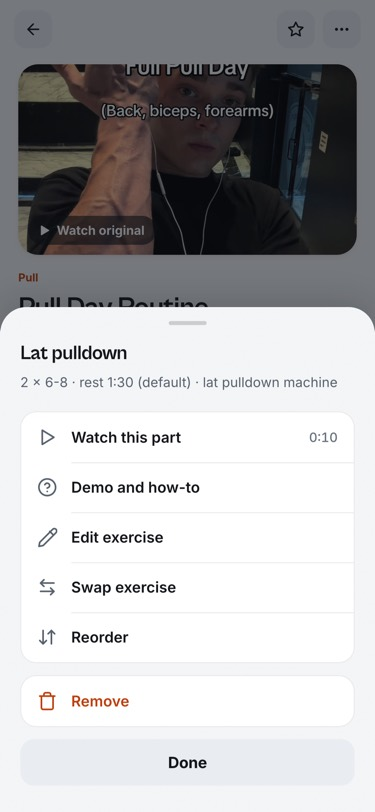 | 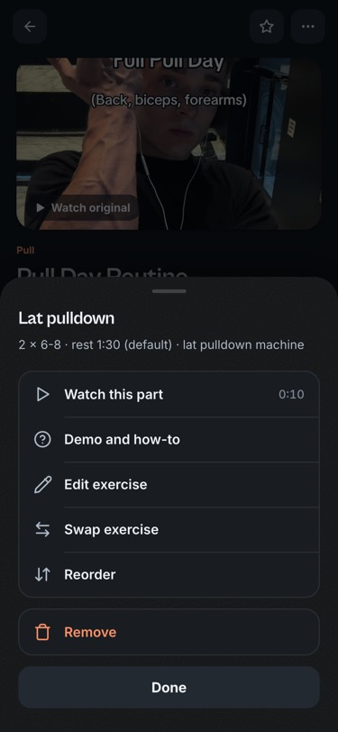 |
| The Plan sheet: the next fourteen days | 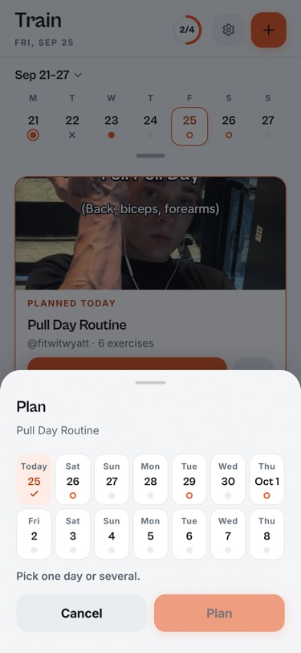 | 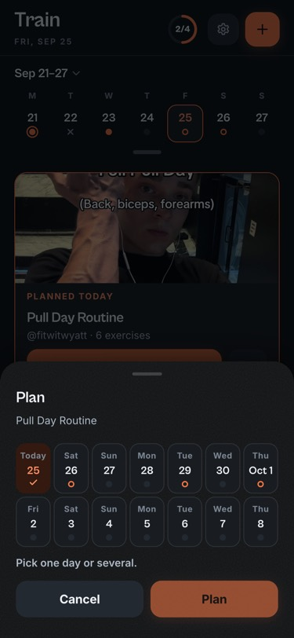 |
| Workout Mode: Exercise 1 of 6, the goal line, Log set | 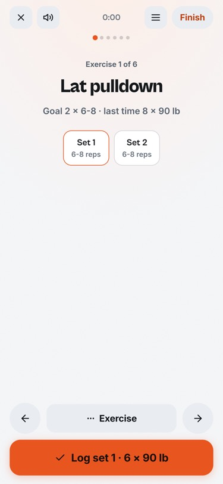 | 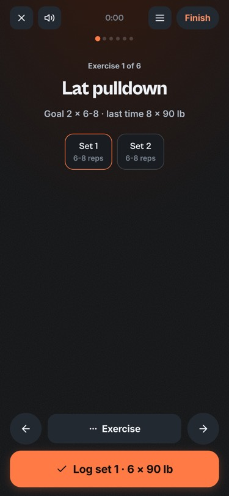 |
| The recap: Plan your next one | 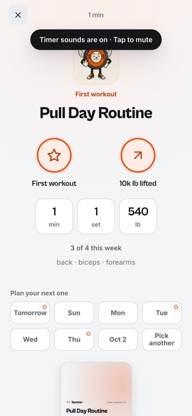 | 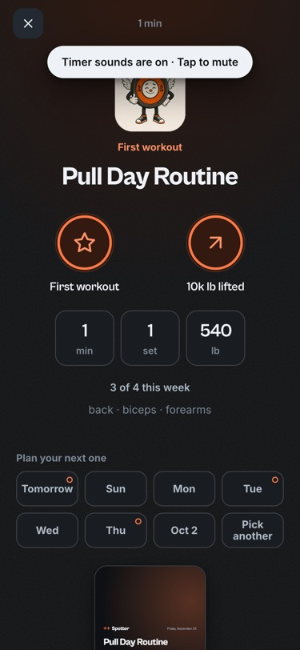 |
| The ready sheet | 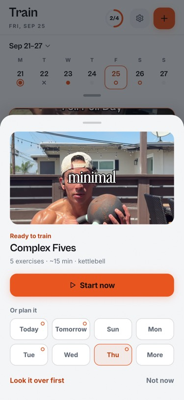 | 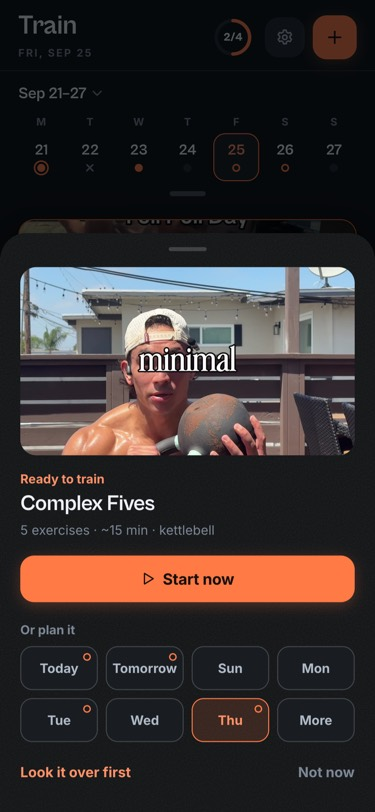 |

Before: `briefs/simplify-b/evidence/before/` (simulator, build 9; not published). The agents' lab frames and simulator
shots, the review, QA's notes and the fix evidence stay under `briefs/simplify-b/` (git-excluded).
